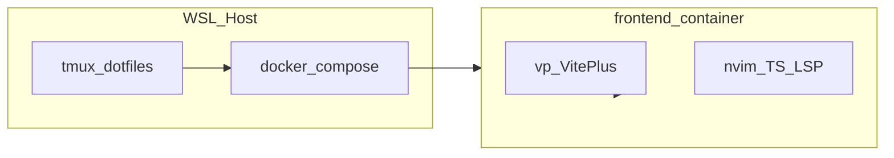

# Docker（Vite+ frontend）+ dotfiles 開発手順

WSL2 上の **dotfiles（Neovim / tmux / Bash）** をそのまま使いながら、
**Vite+（`vp`）用 frontend コンテナ** 内で編集・LSP・dev サーバーを動かす手順です。

| フェーズ | 内容 |
|----------|------|
| **Phase 1（本書）** | frontend コンテナのみ |
| **Phase 2（後続）** | .NET backend コンテナの追加（末尾に概要のみ） |

---

## 全体像



- **ホスト**: tmux・`docker compose`・Git 操作など
- **frontend コンテナ**: `vp dev`、**Neovim**、TypeScript LSP（typescript-tools / oxfmt / oxlint）
- dotfiles の設計上、**WSL ホストの Neovim からコンテナ内 Node を LSP に直接使えません**。
  TS/JS はコンテナ内で編集します。
  参照: [dotfiles README — Docker コンテナ](file:///home/bahori1991/.config/dotfiles/README.md)。

---

## Step 0 — 前提チェック

### 必要な環境

- WSL2（Ubuntu 等）+ Docker（Docker Desktop または engine）
- dotfiles を `~/.config/dotfiles` に clone 済み
- ホストで symlink 済み:

```bash
source ~/.config/dotfiles/scripts/symlink.sh
```

### UID / GID

bind mount した `./frontend` の所有者とコンテナ内ユーザーを揃えます。

```bash
id -u   # 例: 1000
id -g   # 例: 1000
whoami  # 例: bahori1991
```

プロジェクト直下の [`.env`](./.env) に反映します（例）:

```env
UID=1000
GID=1000
DOTFILES_HOST=/home/bahori1991/.config/dotfiles
WORKSPACE=/home/bahori1991/apps/sample
```

テンプレは [`.env.local`](./.env.local) をコピーして実パスに書き換えても構いません。

### コンテナ専用設定の参照

WSL 専用の clip.exe / keychain などの扱いは dotfiles 側にまとまっています。

- [CONTAINER-WSL-SETTINGS.md](file:///home/bahori1991/.config/dotfiles/CONTAINER-WSL-SETTINGS.md)

---

## Step 1 — dotfiles 側（確認・任意修正）

### 必須の dotfiles 変更

**Phase 1 では dotfiles リポジトリの変更は不要** です。`/.dockerenv` があると TS 向け LSP が有効になり、プロンプトに `[docker]`
が付きます（`bash/.bash_prompt`、`nvim/lua/config/lsp-env.lua`）。

### コンテナ初回だけやること

コンテナに入ったあと **1 回**、ホストと同じ symlink を張ります（`~/.config/nvim` などがコンテナの HOME 向けになる）。

```bash
source ~/.config/dotfiles/scripts/symlink.sh
```

dotfiles を `:ro` で mount している場合は、symlink 先は `$HOME/.config/nvim` など **書き込み可能な HOME 配下** なので、dotfiles
本体は read-only のままで問題ありません。

### 任意: コンテナ用 Bash snippet

コンテナ内で URL を開く `BROWSER`（WSL の rundll32）が効かない場合のみ、dotfiles に短い上書きを足す例:

```bash
# 例: ~/.config/dotfiles/bash/.profile の末尾（/.dockerenv があるときだけ）
if [ -f /.dockerenv ]; then
  unset BROWSER
fi
```

### frontend イメージに入れるツール（dotfiles 利用向け）

| 用途 | パッケージ等 |
|------|----------------|
| Neovim | AppImage 展開 → `/usr/local/bin/nvim` |
| Lazy / Mason / Telescope | `ripgrep`, `fd-find`, `git`, `curl` 等 |
| （ビルド系） | `unzip`, `tar`, `build-essential` |
| treemux（**ホスト tmux のみ**なら不要） | `lsof`, `pynvim` |
| Vite+ | 公式インストーラ `https://vite.plus` |

---

## Step 2 — ディレクトリ構成（frontend のみ）

リポジトリ（sample）に次を用意します。**Phase 1 では手順書の例をコピーしてファイル化**してください。

```text
sample/
  .env
  compose.yaml
  frontend/
    Dockerfile
    # 以降: vp create 等で package.json などが増える
```

`frontend/` は空でも構いません（イメージは `sleep infinity` で起動し、プロジェクトはコンテナ内で後から作成）。

---

## Step 3 — `frontend/Dockerfile`（完成例）

ホストと **同じユーザー名・UID/GID・HOME パス** にし、dotfiles / Neovim データの bind と揃えやすくします。
（公式 `ghcr.io/voidzero-dev/vite-plus` の `vp` ユーザーは HOME が `/home/vp` のため、既存 dotfiles マウントと相性が悪いです。）

```dockerfile
# syntax=docker/dockerfile:1
FROM debian:bookworm-slim

ENV DEBIAN_FRONTEND=noninteractive
ENV TZ=Asia/Tokyo

ARG USERNAME=bahori1991
ARG UID=1000
ARG GID=1000
ARG NVIM_VERSION=v0.12.5

# --- システムパッケージ（root） ---
RUN apt-get update && apt-get install -y --no-install-recommends \
    ca-certificates curl git tzdata \
    python3 python3-pip \
    ripgrep fd-find \
    build-essential unzip tar \
    lsof \
  && pip3 install --break-system-packages pynvim \
  && apt-get clean && rm -rf /var/lib/apt/lists/*

# --- Neovim（AppImage 展開） ---
RUN curl -L \
"https://github.com/neovim/neovim/releases/download/${NVIM_VERSION}/nvim-linux-x86_64.appimage" \
      -o /tmp/nvim.appimage \
  && chmod u+x /tmp/nvim.appimage \
  && /tmp/nvim.appimage --appimage-extract \
  && mv squashfs-root /opt/nvim \
  && ln -sf /opt/nvim/usr/bin/nvim /usr/local/bin/nvim \
  && rm -f /tmp/nvim.appimage

# --- ホストと同じ UID のユーザー ---
RUN groupadd -g "${GID}" "${USERNAME}" \
  && useradd -m -u "${UID}" -g "${GID}" -s /bin/bash "${USERNAME}"

USER ${USERNAME}
ENV HOME=/home/${USERNAME}
WORKDIR /home/${USERNAME}

# --- Vite+（vp） ---
ENV VP_HOME="${HOME}/.vite-plus"
ENV PATH="${VP_HOME}/bin:${PATH}"

RUN curl -fsSL --proto "=https" --tlsv1.2 https://vite.plus -o /tmp/vite-plus-install.sh \
  && bash /tmp/vite-plus-install.sh \
  && rm -f /tmp/vite-plus-install.sh

RUN grep -qF '. "$HOME/.vite-plus/env"' "${HOME}/.profile" 2>/dev/null \
  || echo '. "$HOME/.vite-plus/env"' >> "${HOME}/.profile"

# プロジェクト用（compose で ./frontend をここに mount）
WORKDIR /project

EXPOSE 3000
CMD ["sleep", "infinity"]
```

**arm64** の場合は Neovim の AppImage URL を `nvim-linux-arm64.appimage` に変更してください。

---

## Step 4 — `compose.yaml`（frontend のみ）

`.env` の変数を compose が読み込みます。`${HOME}` は **compose を実行する WSL シェル** の HOME です（通常 `/home/bahori1991`）。

```yaml
services:
  frontend:
    build:
      context: ./frontend
      dockerfile: Dockerfile
      args:
        UID: ${UID}
        GID: ${GID}
        USERNAME: bahori1991
    container_name: sample-frontend
    init: true
    stdin_open: true
    tty: true
    working_dir: /project
    env_file: .env
    environment:
      SSH_AUTH_SOCK: ${SSH_AUTH_SOCK:-/tmp/ssh-agent.sock}
    ports:
      - "3000:3000"
    volumes:
      - ./frontend:/project
      - ${DOTFILES_HOST}:/home/bahori1991/.config/dotfiles:ro
      - ${HOME}/.local/share/nvim:/home/bahori1991/.local/share/nvim
      - ${HOME}/.local/state/nvim:/home/bahori1991/.local/state/nvim
      - ${HOME}/.ssh:/home/bahori1991/.ssh:ro
    # Phase 2: backend サービスをここに追加予定
```

**注意**

- ユーザー名を変える場合は、Dockerfile の `USERNAME` / compose 内の `/home/bahori1991/...` パスをすべて揃えてください。
- 初回 `symlink.sh` だけ dotfiles を read-write にしたい場合は、一時的に `:ro` を外して実行後 `:ro` に戻す方法があります。

---

## Step 5 — ビルドと起動

```bash
cd "${WORKSPACE:-/home/bahori1991/apps/sample}"

docker compose --env-file .env build frontend
docker compose --env-file .env up -d frontend
docker compose ps
```

コンテナに入る（login shell で `.profile` → vite-plus env が読まれる）:

```bash
docker compose exec frontend bash -l
```

プロンプトに `[docker]` が出ればコンテナ内です。

---

## Step 6 — コンテナ内初回セットアップ（Vite+）

```bash
# 1) dotfiles リンク（初回のみ）
source ~/.config/dotfiles/scripts/symlink.sh

# 2) ツール確認
nvim --version
vp --version
node --version   # vp install 後に利用可能になる

# 3) プロジェクト作成（/project = ホストの ./frontend）
cd /project
vp create
# または既存テンプレをホスト側 frontend/ に置いてから:
vp install

# 4) 開発サーバー（ホストから http://localhost:3000）
vp dev --host 0.0.0.0 --port 3000
```

`vite.config` で `server.port: 3000` と `server.host: true` を固定すると、毎回フラグを付けなくて済みます。

### Mason（TypeScript 向け）

Neovim 起動後:

```vim
:Mason
```

コンテナ内では `oxfmt` / `oxlint` などを Installed にします（Roslyn は Phase 2 の backend 用）。

### LSP / Formatter 確認

```vim
:checkhealth
:LspInfo          " .ts / .tsx で typescript-tools
:ConformInfo      " oxfmt が available か
```

---

## Step 7 — 日常の開発フロー

### ホスト tmux（推奨）

既存の dotfiles tmux（プレフィックス `Ctrl-t`）のまま、例えば:

| ペイン | 用途 |
|--------|------|
| A | ホスト: `docker compose logs -f frontend` |
| B | `docker compose exec frontend bash -l` → `nvim` |
| C | ホスト: `git` / `curl localhost:3000` |

### よく使うコマンド

```bash
# 停止
docker compose --env-file .env stop frontend

# 再開
docker compose --env-file .env start frontend

# イメージを作り直したとき
docker compose --env-file .env up -d --build frontend
```

---

## Phase 1 完了チェックリスト

- [ ] `docker compose ps` で frontend が `running`
- [ ] コンテナ内 `bash -l` で `[docker]` と `vp --version`
- [ ] `source ~/.config/dotfiles/scripts/symlink.sh` 後、`nvim` が dotfiles 設定で起動
- [ ] `vp dev` が走り、ホストブラウザから `http://localhost:3000` にアクセスできる
- [ ] TS ファイルで `:LspInfo` に typescript-tools が表示される

---

## 付録 A — トラブルシューティング

| 症状 | 想定原因 | 対処 |
|------|----------|------|
| `./frontend` 保存不可 | UID 不一致 | `.env` と Dockerfile の UID を一致 |
| Mason / lazy がおかしい | HOME 不一致 | volume と `HOME` を `/home/bahori1991` で統一 |
| `vp: command not found` | login shell 未使用 | `bash -l` または `. "$HOME/.vite-plus/env"` |
| `vp dev` がすぐ終了 | `package.json` なし | `/project` で `vp create` / `vp install` |
| ホスト nvim で formatter 警告 | 設計どおり | frontend コンテナ内で編集 |
| Neovim ビルド失敗 | curl / AppImage | apt 後に curl、`--appimage-extract` を確認 |
| Git push（SSH）失敗 | keychain スキップ | `~/.ssh` mount、`ssh-add -l`（agent 転送）を確認 |

---

## 付録 B — Phase 2（.NET backend）プレースホルダ

frontend の Phase 1 チェックリストがすべて OK になってから、次を追加する想定です（**詳細手順は未記載**）。

- `backend/Dockerfile`（例: `mcr.microsoft.com/dotnet/sdk:10.0` + 同じ UID/HOME/dotfiles パターン）
- `compose.yaml` に `backend` サービス（API ポート例: `8080:8080`）
- コンテナ内 `:LspInfo` で Roslyn、`:ConformInfo` で `dotnet_format`
- frontend から API を呼ぶ場合は compose の `network` 上のサービス名（例: `http://backend:8080`）

---

## 参考リンク

- [Vite+ — Docker](https://viteplus.dev/guide/docker)
- dotfiles README（Docker コンテナ）: `~/.config/dotfiles/README.md`
- dotfiles CONTAINER-WSL-SETTINGS: `~/.config/dotfiles/CONTAINER-WSL-SETTINGS.md`

